## Анализ производительности REST и gRPC сервисов

> Дисциплина: «Проектирование и развёртывание веб-решений в экосистеме Python»

---

## Описание экспериментального стенда

В рамках работы был реализован и протестирован упрощённый сервис управления терминологическим словарём. Для сравнения использовались два варианта взаимодействия:

- HTTP-сервис на базе **FastAPI**, реализующий REST-подход (каталог `rest`)
- RPC-сервис, использующий **gRPC** и сериализацию данных через **Protocol Buffers** (каталог `grpc`)

> В обоих случаях хранилище данных отсутствует: все сущности находятся исключительно в оперативной памяти приложения.

### Реализованный функционал сервисов

Каждый сервис предоставляет одинаковый набор операций:

- `GET` — получение полного списка терминов
- `POST` — добавление нового термина
- `PUT` — изменение существующего термина

---

## Нагрузочное тестирование

Для оценки производительности были подготовлены сценарии нагрузочного тестирования с использованием **Locust**.

### Клиенты нагрузки

- REST-клиент: `GlossaryRestUser` (`locust-tests/rest_client.py`)
- gRPC-клиент: `GlossaryGrpcUser` (`locust-tests/grpc_client.py`)

### Поведение виртуальных пользователей

- Запросы выполняются последовательно
- Пауза между запросами — случайное значение от 1 до 3 секунд
- Распределение операций:
  - 60% — получение списка терминов (`GET`)
  - 30% — добавление нового термина (`POST`)
  - 10% — обновление существующего (`PUT`)

---

## Профили нагрузки

### 1. Минимальная нагрузка (sanity check)

**Параметры:**
- Пользователи: до 10
- Рост: 2 пользователя/сек
- Длительность: 30 секунд

**Ожидания:**
- Линейный рост RPS
- Отсутствие деградации
- Незначительное увеличение времени ответа

---

### 2. Рабочий режим

**Параметры:**
- Пользователи: до 50
- Рост: 5 пользователей/сек
- Длительность: 60 секунд

**Ожидания:**
- Стабильная работа
- Умеренный рост латентности
- Предсказуемое поведение RPS

---

### 3. Стресс-тест (высокая нагрузка)

**Параметры:**
- Пользователи: до 600
- Рост: 5 пользователей/сек
- Длительность: 120 секунд

**Ожидания:**
- Достижение предела пропускной способности
- Рост времени отклика
- Снижение RPS после пиковых значений

---

### 4. Длительная нагрузка (проверка стабильности)

**Параметры:**
- Пользователи: до 30
- Рост: 3 пользователя/сек
- Длительность: 600 секунд

**Ожидания:**
- Стабильный RPS
- Отсутствие резких деградаций
- Накопительный рост времени ответа

---

## Запуск тестовых сценариев

> Все команды выполняются из корневой директории проекта

### REST-сервис

1. Создание и активация виртуального окружения:
python -m venv venv
venv\Scripts\activate

markdown
Копировать код

2. Установка зависимостей:
pip install -r requirements.txt

markdown
Копировать код

3. Запуск приложения:
uvicorn rest.app:app

markdown
Копировать код

4. Запуск Locust:
python -m locust -f locust-tests/rest_client.py --host=http://127.0.0.1:8000

markdown
Копировать код

5. Интерфейс Locust:
http://localhost:8089

yaml
Копировать код

---

### gRPC-сервис

1. Создание и активация виртуального окружения:
python -m venv venv
venv\Scripts\activate

markdown
Копировать код

2. Установка зависимостей:
pip install -r requirements.txt

markdown
Копировать код

3. Генерация gRPC-кода:
python -m grpc_tools.protoc -Igrpc/protobufs --python_out=grpc --grpc_python_out=grpc grpc/protobufs/glossary.proto

markdown
Копировать код

4. Запуск сервера:
python grpc/server.py

markdown
Копировать код

5. Запуск Locust:
python -m locust -f locust-tests/grpc_client.py --host=http://127.0.0.1:50051

markdown
Копировать код

6. Интерфейс Locust:
http://localhost:8089

yaml
Копировать код

---

## Условия проведения эксперимента

Тестирование выполнялось локально на следующей аппаратной платформе:

| Параметр | Значение |
|---------|----------|
| Устройство | MacBook Pro |
| Процессор | Apple M3 Pro |
| Оперативная память | 64 GB |
| Накопитель | 1 TB SSD |
| Операционная система | macOS |
| Браузер | Google Chrome |

---

## Результаты тестирования

### REST

1. Минимальная нагрузка  
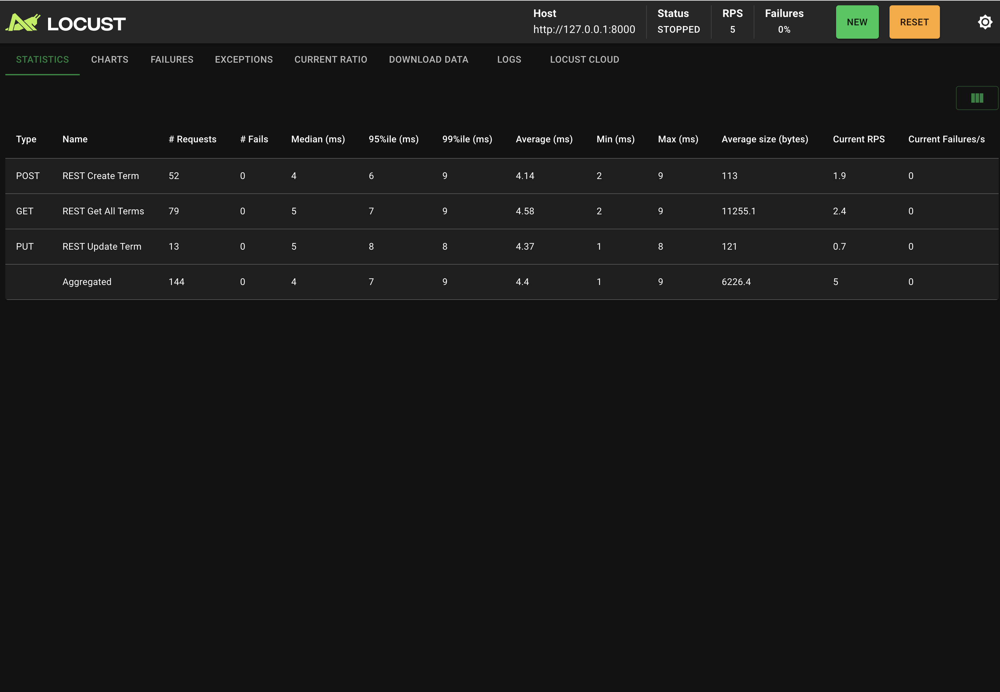  
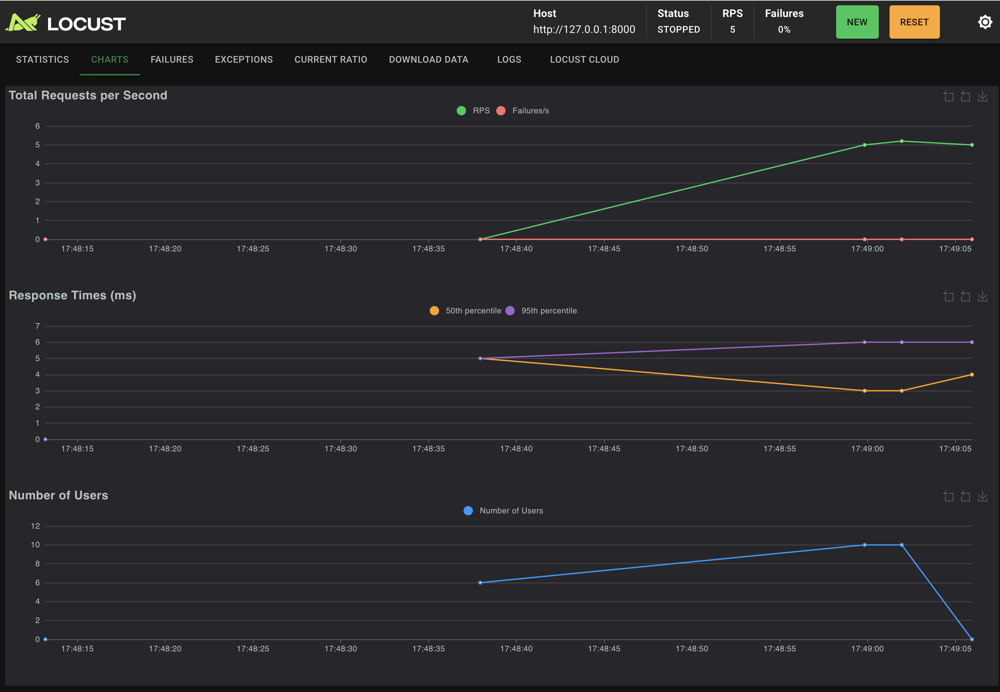

2. Рабочий режим  
  
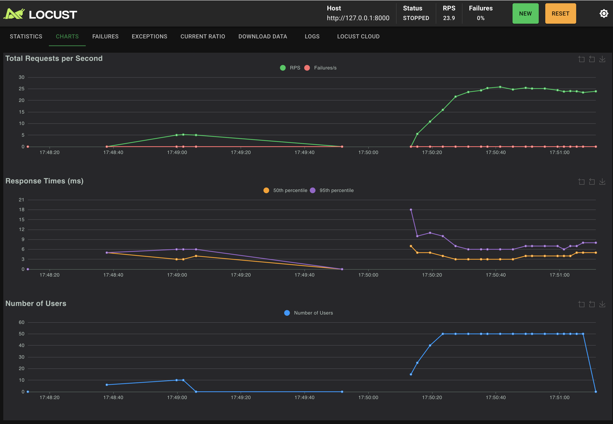

3. Стресс-тест  
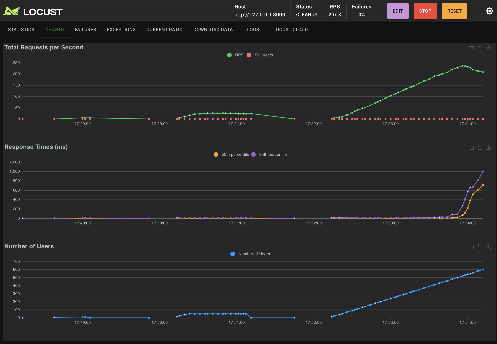  

4. Длительная нагрузка  
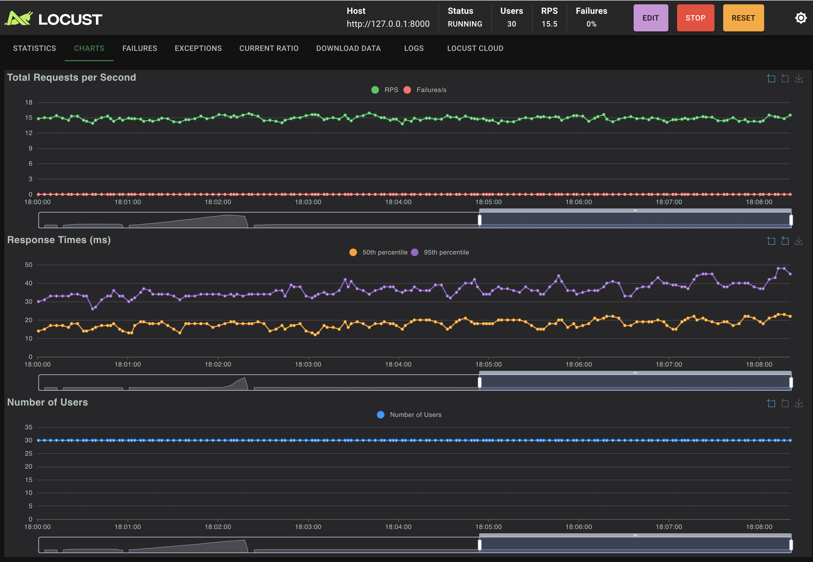  

---

### gRPC

1. Минимальная нагрузка  
  
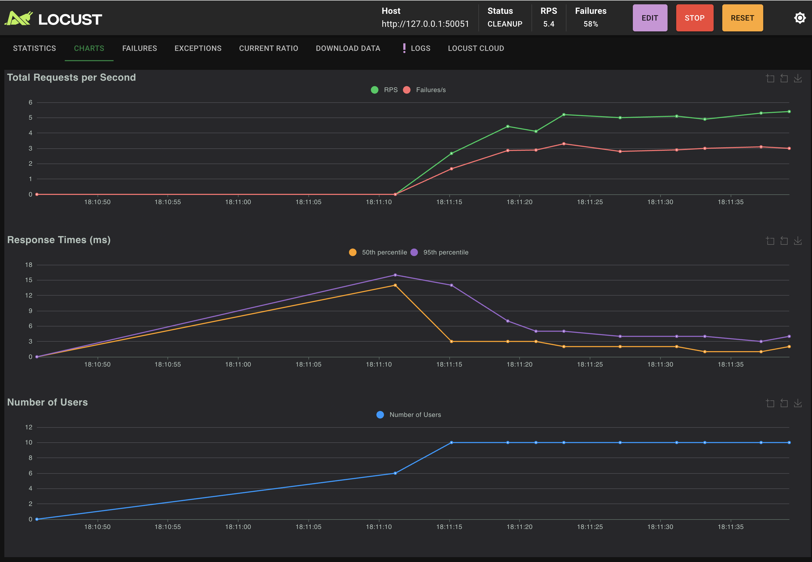

2. Рабочий режим  
  
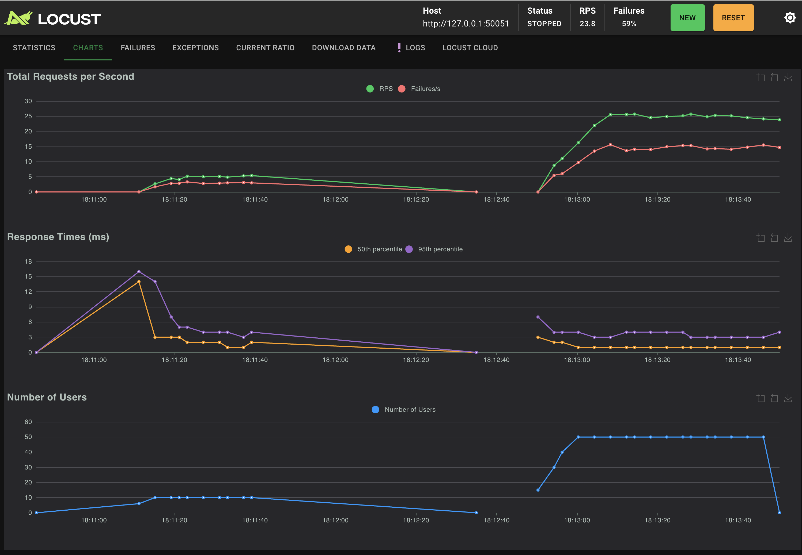

3. Стресс-тест  
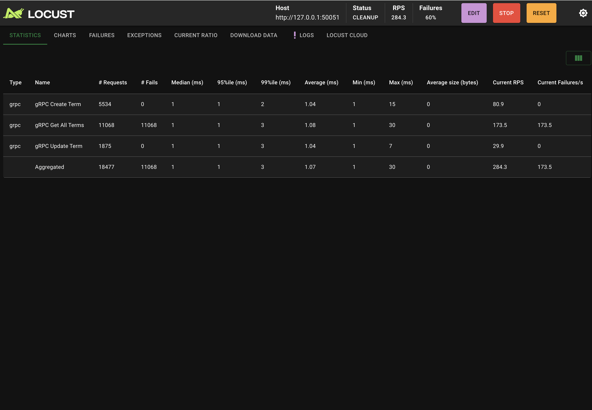  
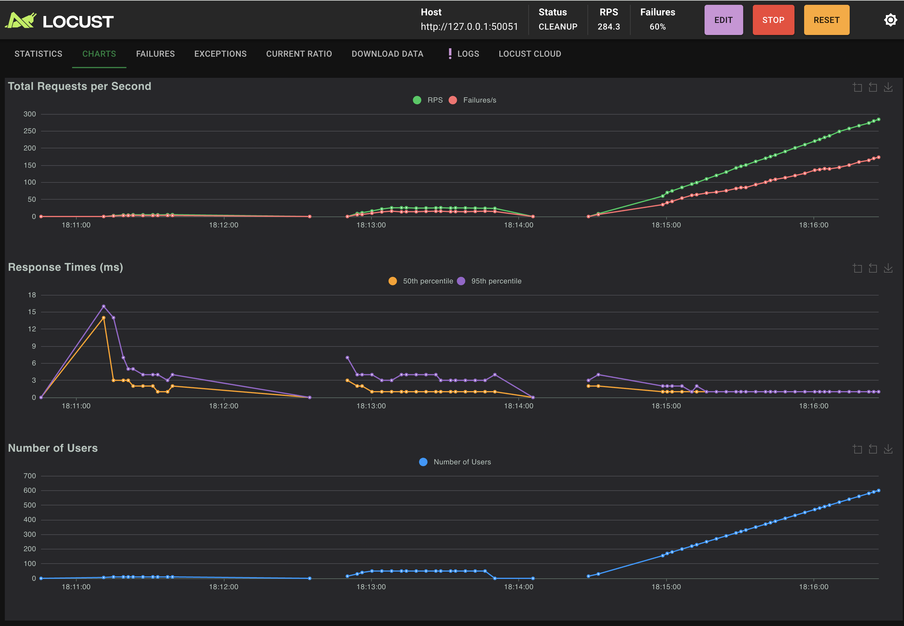

4. Длительная нагрузка  
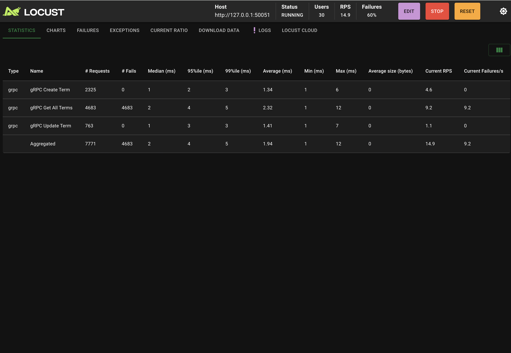  
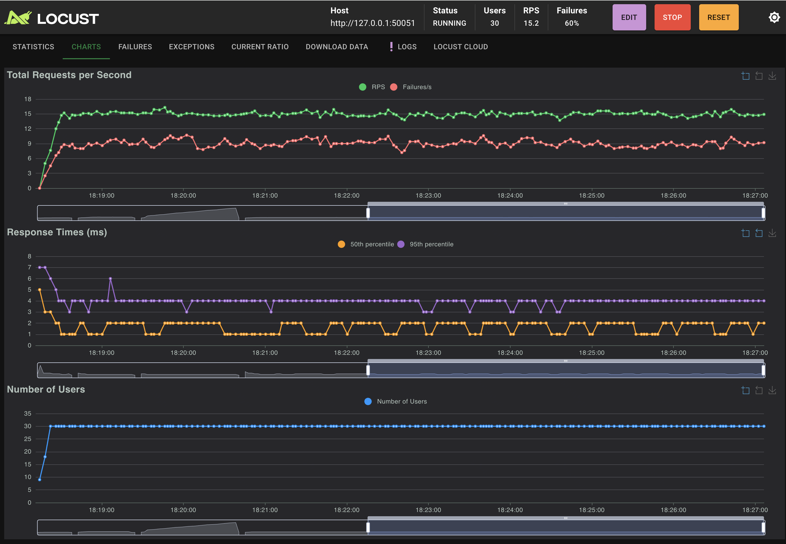

---

## Анализ результатов

- REST-сервис начинает демонстрировать деградацию при приближении к ~500 одновременным пользователям
- gRPC сохраняет более стабильные показатели при аналогичной нагрузке
- До достижения предельной нагрузки рост RPS и латентности происходит плавно
- Отсутствие механизма удаления данных может приводить к увеличению потребления памяти при длительной работе

---

## Сравнение подходов

- **Латентность:** gRPC стабильнее на высоких перцентилях
- **Пропускная способность:** gRPC демонстрирует более высокий RPS при высокой нагрузке
- **Накладные расходы:** REST проще в реализации, gRPC — эффективнее с точки зрения ресурсов

### Рекомендации по применению

- **REST** — подходит для быстрых MVP, публичных API и систем с умеренной нагрузкой
- **gRPC** — предпочтителен для микросервисных систем и внутренних взаимодействий при высоких требованиях к производительности

---

## Итоговое заключение

gRPC показал более высокую стабильность и масштабируемость, однако потребовал большей сложности реализации. Для улучшения эксперимента в будущем стоит:

- добавить постоянное хранилище данных
- реализовать пагинацию
- проводить тестирование в распределённой среде
- учитывать сетевые задержки и внешние зависимости

### Ограничения эксперимента

- Все компоненты запускались на одном устройстве
- Отсутствовала реальная сеть и база данных
- Нагрузка носила синтетический характер